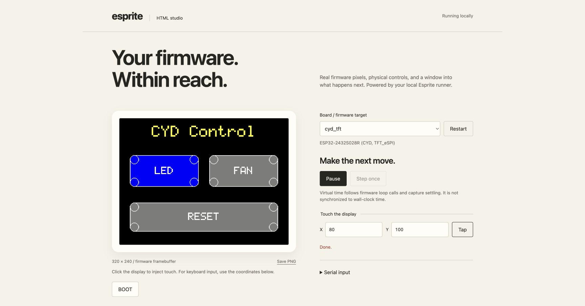
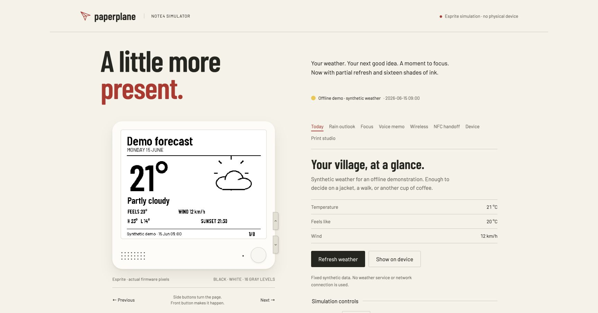

# esprite

**Run your ESP32 firmware on your computer.**
See its pixels. Drive its inputs. Test what happens next.

Esprite gives firmware a local simulator with a CLI, an optional native window,
and a browser studio. Compile your Arduino / ESP-IDF application against host
shims for fast feedback, or run a compiled flash image with the optional QEMU
backend. Your firmware does the drawing and handles the inputs.



*The included `cyd_tft` demo after a real touch injection. The screen is the
firmware framebuffer, not an HTML recreation.*

## Try it in a minute

On Apple Silicon macOS or x86-64 Linux:

```sh
brew install rvben/tap/esprite
esprite list-targets
python3 "$(brew --prefix esprite)/share/esprite/html-studio/server.py" \
  --runner "$(command -v esprite)" --target cyd_tft
```

Open the local URL printed in your terminal. Tap **LED** on the display, press
the board's **BOOT** button, pause execution, or save a PNG. Python 3.9+ is needed
only for the browser studio; it uses the standard library with no extra packages.

Prefer a download? Extract a [release archive](https://github.com/rvben/esprite/releases),
then run:

```sh
python3 examples/html-studio/server.py --runner ./esprite --target cyd_tft
```

The crates.io and PyPI entries reserve the package name; they do not install
the simulator. Use Homebrew, a release archive, or a source build.

## Three ways to work

| Interface | Best for | Start here |
| --- | --- | --- |
| **HTML studio** | Exploring firmware with touch, buttons, serial input and PNG export | [Studio guide](examples/html-studio/README.md) |
| **CLI and JSON session** | Automated checks, screenshots and agent-driven testing | [CLI reference](docs/reference.md#cli) |
| **Native SDL window** | A desktop device view with clickable bezel controls | `esprite serve --target cyd_tft --window` |

The studio discovers each runner's physical controls. Pause and step firmware,
switch targets, inspect serial output, or inject battery values when the board
supports them. It binds to loopback and serves its own assets locally.

## Your firmware, your front end

Keep your application in its own repository. Esprite provides CMake helpers to
build a project-specific runner, so you can retain your own product UI or use
the generic HTML studio without modifying Esprite.



*Paperplane is a separate e-paper desk-companion application. This capture uses
synthetic weather in an isolated offline demo—no personal location, network
names, recordings, or device identifiers. Paperplane is not bundled in Esprite.*

The integration compiles Paperplane's actual C++ application, canvas renderer
and panel adapter. Its browser front end exchanges JSON with an Esprite runner;
there is no second implementation of its focus timer or device drawing code.
Read the [reference application pattern](docs/reference-app.md) for the boundary
between shared firmware, the browser bridge and physical hardware tests.

```cmake
include(FetchContent)
FetchContent_Declare(esprite
  GIT_REPOSITORY https://github.com/rvben/esprite.git
  GIT_TAG v0.5.0)
FetchContent_MakeAvailable(esprite)

esprite_add_sim_target(my_board board.cpp sketch.cpp)
esprite_add_runner(my_sim TARGET my_board)
```

A board profile supplies display dimensions and input capabilities; `sketch.cpp`
supplies `setup()` and `loop()`. The [onboarding guide](docs/onboarding.md) covers
standard Arduino sketches, application HAL adapters and QEMU board profiles.
The [integration guide](docs/integration.md) covers consumer builds and CI.

## Make a behavior reproducible

Each one-shot command boots a fresh target. Use `run` to keep one firmware
session alive across commands:

```sh
esprite run <<'JSON'
{"cmd":"boot","target":"cyd_tft"}
{"cmd":"tap","x":80,"y":100}
{"cmd":"screenshot","out":"led-on.png"}
{"cmd":"logs"}
{"cmd":"quit"}
JSON
```

You get one JSON reply per input line. Screenshots contain the actual pixels;
LVGL targets also expose a widget tree through `ui` and accept `tap --ref eN`.
For CI, store ordered steps in a [scenario](docs/integration.md) and assert
serial output or framebuffer pixels.

`esprite schema` describes commands, output fields, retry effects, pagination,
errors and non-error outcomes using [CLI Spec 0.3](https://clispec.dev/schema/v0.3.json).
Global options work before or after the command. List output defaults to 100
items and supports `--limit`, `--offset` and exact `--fields` selection.
Commands that boot arbitrary firmware are conservatively marked non-idempotent:
repeating them may update persistent simulated state or repeat an input.
These CLI contract improvements are in source after v0.5.0.

## Choose the right backend

| | Host-native | QEMU |
| --- | --- | --- |
| Input | Firmware source compiled for your computer | ESP32 flash image |
| Useful for | Application logic, rendering, parsing, quick regression checks | Running the target architecture, RTOS and binary components |
| Display libraries | LVGL, Arduino_GFX, TFT_eSPI | Firmware using Espressif's virtual RGB panel |
| Inputs | Buttons, GPIO, touch; other peripherals depend on the board | Serial; touch/GPIO need the cooperating input agent |
| Browser studio | Yes | Use the CLI or SDL window |
| Timing | Virtual firmware steps | ESP32-C3 icount; Xtensa wall-clock timing |

Neither backend reproduces the physical radio, speaker, microphone, battery
life, or e-paper panel electronics. Simulated sleep is a lifecycle test, not a
power measurement. Keep on-device checks for those behaviors.

[QEMU setup, capabilities and examples →](docs/reference.md#the-qemu-backend)

## Build and test

Requires CMake 3.20+, a C++17 compiler and Git. CMake fetches pinned LVGL and
ArduinoJson sources; doctest and stb are vendored. SDL2 is optional.

```sh
git clone https://github.com/rvben/esprite.git
cd esprite
make build
make test
./build/esprite screenshot demo.png --target cyd_tft
```

The public build includes `sample_gfx`, `cyd` and `cyd_tft`. No separate firmware
checkout is required. The optional agentgauge target requires its own source;
see the onboarding guide. QEMU integration tests require the
[emulator and fixtures](docs/reference.md#the-qemu-backend); they skip when those
are unavailable.

The suite covers the CLI contract, daemon recovery, HTML bridge lifecycle,
framebuffer rendering, GPIO behavior, LVGL flushes and optional QEMU fixtures.
Run `clispec score ./build/esprite` separately when the CLI Spec checker is installed.

## Go further

- [Add a firmware project](docs/onboarding.md)
- [Embed Esprite in your build and CI](docs/integration.md)
- [Customize the HTML studio](examples/html-studio/README.md)
- [CLI, native window and QEMU reference](docs/reference.md)
- [Reproduce the documentation screenshots](docs/screenshots.md)

Esprite is MIT licensed. Dependencies retain their own licenses.
